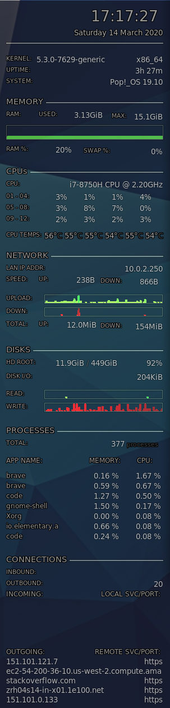

# Conky Config



## Prerequisites

### Tools
```bash
sudo apt install conky-all
```

### Configuration
Adjust the `hwmon X temp Y` (e.g. `hwmon 7 temp 2`) values by finding the CPU core information (`coretemp`):
```bash
⋊> ~ cat /sys/class/hwmon/hwmon*/name
AC
acpitz
BAT0
hidpp_battery_0
hidpp_battery_1
pch_cannonlake
thinkpad
coretemp
iwlwifi
⋊> ~ ls -la /sys/class/hwmon/hwmon*/name
-r--r--r-- 1 root root 4096 Mar 14 13:50 /sys/class/hwmon/hwmon0/name
-r--r--r-- 1 root root 4096 Mar 14 13:50 /sys/class/hwmon/hwmon1/name
-r--r--r-- 1 root root 4096 Mar 14 13:50 /sys/class/hwmon/hwmon2/name
-r--r--r-- 1 root root 4096 Mar 14 13:50 /sys/class/hwmon/hwmon3/name
-r--r--r-- 1 root root 4096 Mar 14 13:50 /sys/class/hwmon/hwmon4/name
-r--r--r-- 1 root root 4096 Mar 14 13:50 /sys/class/hwmon/hwmon5/name
-r--r--r-- 1 root root 4096 Mar 14 13:50 /sys/class/hwmon/hwmon6/name
-r--r--r-- 1 root root 4096 Mar 14 13:50 /sys/class/hwmon/hwmon7/name
-r--r--r-- 1 root root 4096 Mar 14 13:50 /sys/class/hwmon/hwmon8/name
⋊> ~ ls -la /sys/class/hwmon/hwmon7/
total 0
drwxr-xr-x 3 root root    0 Mar 14 13:50 ./
drwxr-xr-x 3 root root    0 Mar 14 13:50 ../
lrwxrwxrwx 1 root root    0 Mar 14 13:50 device -> ../../../coretemp.0/
-r--r--r-- 1 root root 4096 Mar 14 13:50 name
drwxr-xr-x 2 root root    0 Mar 14 15:04 power/
lrwxrwxrwx 1 root root    0 Mar 14 13:50 subsystem -> ../../../../../class/hwmon/
-r--r--r-- 1 root root 4096 Mar 14 13:50 temp1_crit
-r--r--r-- 1 root root 4096 Mar 14 13:50 temp1_crit_alarm
-r--r--r-- 1 root root 4096 Mar 14 13:50 temp1_input
-r--r--r-- 1 root root 4096 Mar 14 13:50 temp1_label
-r--r--r-- 1 root root 4096 Mar 14 13:50 temp1_max
-r--r--r-- 1 root root 4096 Mar 14 13:50 temp2_crit
-r--r--r-- 1 root root 4096 Mar 14 13:50 temp2_crit_alarm
-r--r--r-- 1 root root 4096 Mar 14 13:50 temp2_input
-r--r--r-- 1 root root 4096 Mar 14 13:50 temp2_label
-r--r--r-- 1 root root 4096 Mar 14 13:50 temp2_max
-r--r--r-- 1 root root 4096 Mar 14 13:50 temp3_crit
-r--r--r-- 1 root root 4096 Mar 14 13:50 temp3_crit_alarm
-r--r--r-- 1 root root 4096 Mar 14 13:50 temp3_input
-r--r--r-- 1 root root 4096 Mar 14 13:50 temp3_label
-r--r--r-- 1 root root 4096 Mar 14 13:50 temp3_max
-r--r--r-- 1 root root 4096 Mar 14 13:50 temp4_crit
-r--r--r-- 1 root root 4096 Mar 14 13:50 temp4_crit_alarm
-r--r--r-- 1 root root 4096 Mar 14 13:50 temp4_input
-r--r--r-- 1 root root 4096 Mar 14 13:50 temp4_label
-r--r--r-- 1 root root 4096 Mar 14 13:50 temp4_max
-r--r--r-- 1 root root 4096 Mar 14 13:50 temp5_crit
-r--r--r-- 1 root root 4096 Mar 14 13:50 temp5_crit_alarm
-r--r--r-- 1 root root 4096 Mar 14 13:50 temp5_input
-r--r--r-- 1 root root 4096 Mar 14 13:50 temp5_label
-r--r--r-- 1 root root 4096 Mar 14 13:50 temp5_max
-r--r--r-- 1 root root 4096 Mar 14 13:50 temp6_crit
-r--r--r-- 1 root root 4096 Mar 14 13:50 temp6_crit_alarm
-r--r--r-- 1 root root 4096 Mar 14 13:50 temp6_input
-r--r--r-- 1 root root 4096 Mar 14 13:50 temp6_label
-r--r--r-- 1 root root 4096 Mar 14 13:50 temp6_max
-r--r--r-- 1 root root 4096 Mar 14 13:50 temp7_crit
-r--r--r-- 1 root root 4096 Mar 14 13:50 temp7_crit_alarm
-r--r--r-- 1 root root 4096 Mar 14 13:50 temp7_input
-r--r--r-- 1 root root 4096 Mar 14 13:50 temp7_label
-r--r--r-- 1 root root 4096 Mar 14 13:50 temp7_max
```

Replace `wlp0s20f3` with the actual network interface name you would like to monitor.

## Installation
```bash
git clone git@github.com:PhilipSchmid/conky-config.git
cd conky-config/
cp .conkyrc ~/
```

## Autostart
Add `conky -p 20` to your autostart.

## Available Conky Variables
See http://conky.sourceforge.net/variables.html

## Credit
- https://github.com/kematzy/conky
- https://github.com/pascalwhoop/conky.conf